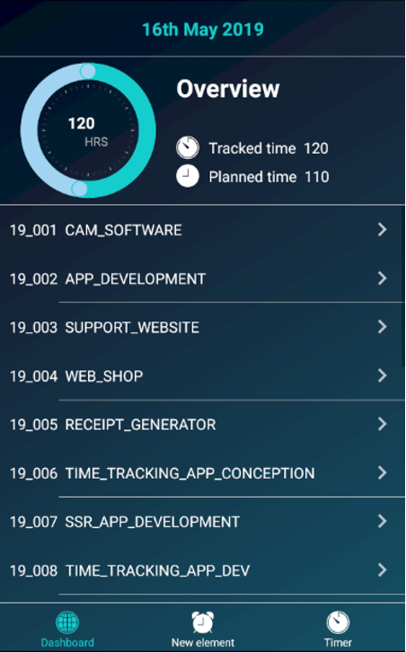
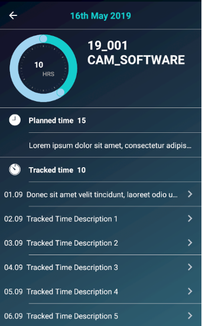
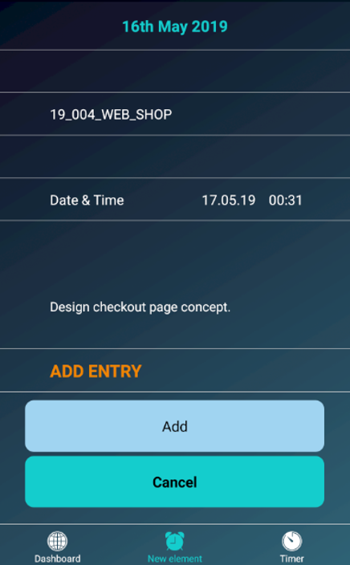
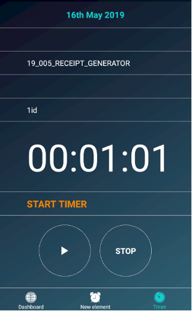

# React Native Time Tracking App
An old React Native app for work time tracking. It provides an overview of different projects, offers a timed or manual time entry, and time deletion.

### Screenshots

Login:

Overview:

Project:

Task:

Time adding (manually):

Time adding (w/ timer):

### Running locally
1. `git clone`
2. Install the necessary dependencies / fix any outdated ones
3. `npm run ios` or `npm run android`